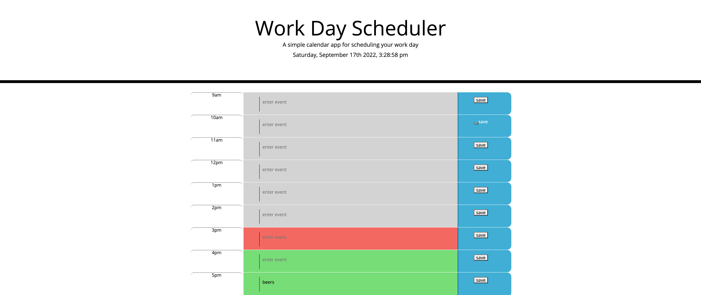

# Alli Dodt WORK-DAY-SCHEDULER

## Table of Contents
- [Description](#description)
- [Link to Website](#website-link)
- [Github Repository](#github-repo)
- [Screenshot](#screenshot)
- [Liscense](#license)

#
#
### Description
#### Create a work day scheduler for an 8-hour work day. Current time and day are posted at top of the page. Events are saved when the page is refrshed. 

#

### Link to Website: [Website](https://adodt.github.io/work-day-scheduler/)

### Github Repository: [work-day-scheduler](https://github.com/adodt/work-day-scheduler)

#
### Screenshot 

#
### License [MIT](http://choosealicense.com/licenses/mit/)